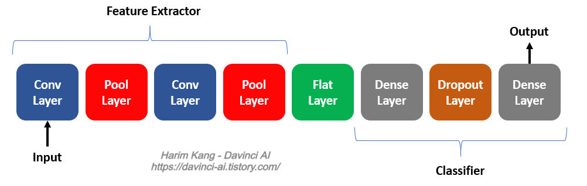

# CNN (Convolutional Neural Network : 합성공 인공신경망)

## CNN summary



- model 생성
```python
model = Sequential() # Sequential : layer를 선형으로 연결
```

#### 특징 추출 (Feature Extraction)
    + Convolution Layer + Pooling Layer를 반복하여 구성
    + 이미지 분석은 다른 데이터와 다르게 데이터의 값이 주변 픽셀 데이터와 연관성이 높다는 것에 착안하여 이미지 픽셀을 주변 이미지 픽셀로 대체하는 것

#### 분류기 (Classifier)
    + Dense Layer + Dropout Layer를 반복하고 마지막 Dense Layer로 구성


## Convolution Layer (합성곱 Layer)

#### 합성곱 (Convolution : Conv)


- 방식 : 일정 크기를 가진 filter, kernel를 일정간격(Stride)으로 이동하면서 연산
- filter : 모델이 돌아가면서 찾아가는 값
```python
Cov2D(filters=64,              # 생성할 filter 수를 지정
      kernel_size=(5,5),       # filter, kernel 크기 지정
      strides=(1,1),           # filter가 skip하면서 이동할 크기 지정
      padding='same',          # valid:padding생성x, same:padding생성(size유지)
      activation='relu',       # 활성화함수
      input_shape=(28,28,1))
```

#### Pooling (풀링)


- 방식 : MaxPooling(최대값으로 축소), MeanPooling(평균값으로 축소), MinPooling(최소값으로 축소) 존재
         일정 사이즈의 map의 값들을 해당값(max or mean or min)으로 사용해서 map을 축소
- 의미 : 필터를 통해 얻은 특징들 중에 가장 특출난 특징만을 사용
```python
MaxPooling2D(pool_size=(2,2),       # map 사이즈를 지정
             strides=(2,2))         # map이 스킵하면서 이동할 pixel 수 지정
```

#### Flatten
- 2차원 data를 1차원 데이터로 변환하는 역할을 하는 Layer
```python
Flatten()
```

#### Dropout


- 모델이 overfitting(과적합)되는 것을 방지하기 위하여 학습과정에서 무작위로 뉴런의 집합을 제거
```python
Dropout(rate=0.2) # 해당 비율 만큼의 뉴런의 집합을 제거
```

#### Dense


- Convolution + Pooling + Dropout을 통해 감소된 차원으로 완전연결 계층을 생성
```python
Dense(units=512,                # 연결될 layer의 개수를 지정
      activation='relu')        # 활성화 함수
```

