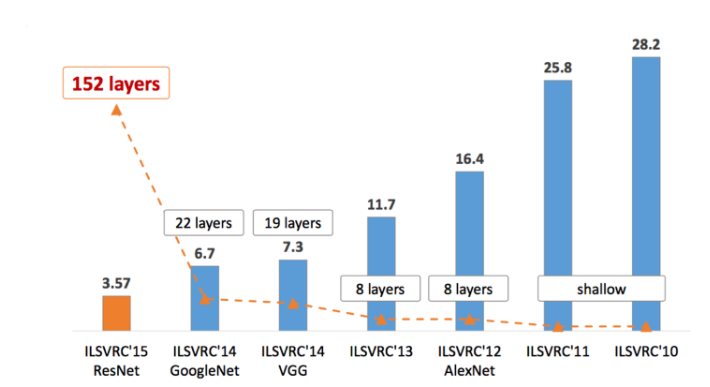
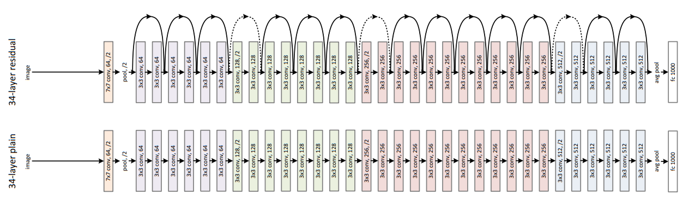
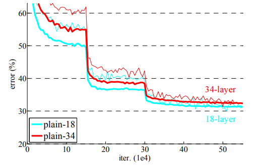

# ResNet (Deep Residual Learning for Image Recognition)

- Microsoft에서 개발한 ResNet이 ILSVRC 2015대회에서 152개 layer의 모델로 1등

### ResNet의 원리

- 원래 x의 output인 H(x)를 학습하던 원리에서 Residual Function F(x) = H(x) - x를 최소화하는 방향으로 즉 출력과 입력차이를 줄이는 것을 목표로 수정. 여기서 x는 정해진 값이므로 F(x)가 0이 되는 것이 최적의 해이고, 결과 H(x)=x로 H(x)를 x로 mapping 하는 것이 학습의 목표가 된다. 이를 구현하기 위하여 H(x) = F(x) + x이므로  

위의 그림과 같이 rayer사이에 shortcut rayer를 만들어 input값이 바로 더해질 수 있는 구조를 생성한다. 결과 곱셈 연산에서 덧셈 연산으로 변형되어 몇개의 layer를 건너뛰는 효과가 있었고, forward와 backward 구조가 단순화되어 gradient 소멸 문제를 해결할 수 있었다고 한다.

 

- 위의 plain model에 비하여 아래의 resnet model은 깊은 layer를 쌓아도 모델의 성능이 크게 떨어지지 않는 것을 볼 수 있다.