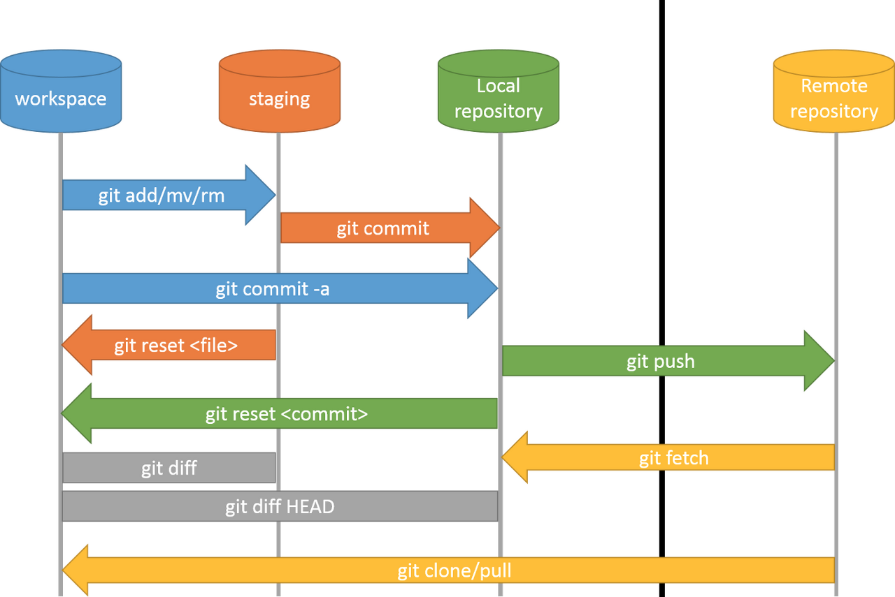

# Git

## Git 개념
<br>



- 중요 명령어
    + git clone : 원격 저장소를 로컬로 clone
    + git add <파일이름> : rocal에서의 수정 이력을 stage 영역으로 add
    + git commit -m 'message' : stage 영역을 commit으로 생성
    + git push [remote] [rocal] : rocal의 commit을 origin으로 push
    + git fetch : origin의 commit을 rocal로 fetch
    + git merge : commit을 rocal diretory에 저장
    + git pull : fetch + merge를 한꺼번에 진행
    + git reset : 해당 commit으로 branch를 이동
    + git checkout : 해당 commit 또는 branch로 head를 이동
- 명령어 추가 설명
    + git clone --bare & --mirror : 현재 repo를 다른 repo로 복제할때 이용
        * --bare : 원격저장소 정보를 같이 저장 X, 추후에 원격저장소를 추적 X
        * --mirror : 원격저장소 정보를 같이 저장
    + git push -u [remote] [rocal] : rocal을 처음 remote에 push할때에 push할 원격저장소를 지정


### Git Mirroring (GitLab=A -> GitHub=B)
- mirroring address bare : remote정보 삭제
```bash
git clone --bare [A]
```
- pushing
```bash
git push --mirror [B]
```

##### 50MB 넘는 파일 및 커밋 mirroring
GitHub는 50MB 넘는 data와 그 data가 포함되는 commit은 mirroring 불가능

- git lfs를 통해 100MB 이상의 커밋을 옮김 (clone --bare까지 진행 후)
```bash
cd [A.git]
git lfs fetch --all
git push --mirror B
git lfs push --all B
```
- BFG Repo-Cleaner 사용 (위의 방법을 시행하고 remote rejected 에러 발생시)
[BFG Repo Cleaner download](https://rtyley.github.io/bfg-repo-cleaner/)
```bash
cd [A.git]
java -jar [bfg file route] --strip-blobs-bigger-than 50M
```
커밋, 브랜치, 태그를 업데이트 하지만 물리적으로 삭제하지 않음
- 커밋, 브랜치, 태그 물리적 삭제
```
git reflog expire --expire=now --all && git gc --prune=now --aggressive
git push --mirror B
```
