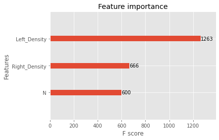

# LightGBM Algorithm
- 설명 : 리프 중심 트리 분할 (Leaf Wise) 방식의 Gradient Boosting Model
        트리의 균형을 맞추지 않고 최대 손실 값을 가지는 leaf node를 지속적으로 분할하면서 비대칭적인 트리를 생성, 균형 트리 분할 방식보다 예측 오류 손실을 최소화
- XGBoost와의 비교
    + 빠른 학습 및 예측 수행 시간
    + 더 작은 메모리 사용량
    + 카테고리형 피처의 자동 변환 및 최적 분할

## params
* 일반 파라미터
    + boosting (default=gbdt)
        - gbdt : 기존 Gradient Boosting 의사결정트리
        - rf : Random Forest
        - dart
        - goss : 기울기 기반 단측 샘플링
    + num_iterations (default=100) : 부스팅 반복 횟수
    + num_threads (default=0) : thread 수
* 부스터 파라미터
    + learning_rate (default=0.1) : 학습률
    + num_leaves (default=31) : 한나무의 최대 잎 수
    + tree_learner (default=serial)
        - serial : 단일 머신 트리 학습기
        - feature : 기능 병렬 트리 학습기
        - data : 데이터 병렬 트리 학습기
        - voting : 투표 병렬 트리 합습기
    + device_type (default=cpu) : 트리 학습을 위한 장치
* 학습 과정 파라미터
    + objective (default=regression)
        - 회귀
            - regression : l2손실
            - regression_l1 : l1 손실
            - huber : 후버손실
            - fair : 공정 손실
            - poisson : 포아송
            - quantile : 분위수
            - mape : MAPE 손실
            - gamma : 로그 링크를 사용한 감마 회귀
            - tweedie : 로그 링크를 사용한 Tweedie 회귀
        - 이진분류
            - binary : 이진 로그 손실 분류
        - 다중 클래스 분류
            - multiclass : softmax 목정 함수
            - multiclassova : 일대일 이항 목적 함수
            num_class 설정 필요
    + max_depth (default=-1) : 트리 최대 깊이를 제한 (<0 제한 X)
    + min_data_in_leaf (default=20) : 하나의 리프에 있는 최소 데이터 수
    + min_sum_hessian_in_leaf (default=le-3) : 한 잎의 최소 합
    + beggin_fraction (default=1.0) : 데이터의 일부를 무작위로 선택
    + pos_bagging_fraction (default=1.0) : 불균형 이진 분류 문제에서 bagging의 양성 샘플을 무작위로 샘플링
    + neg_bagging_fraction (default=1.0) : 불균형 이진 분류 문제에서 bagging의 음성 샘플을 무작위로 샘플링
    + bagging_freq (default=0) : k반복마다 bagging 시행
    + early_stopping_round (default=0) : 해당값 안에서 개선되지 않으면 훈련 중지
    + verbosity (default=1)
        - 0 = 오류
        - 1 = 정보
        - > 1 = 디버그

- pip install
```bash
pip3 install lightgbm
```

## model fitting
- Regressor
```python
from lightgbm import LGBMRegressor
model = LGBMRegressor([params])
model.fit(X_train,Y_train)
```
- Classifier
```python
from lightgbm import LGBMClassifier
model =LGBMClassifier([params])
model.fit(X_train, Y_train)
```

## LightGBM model 검사
- model predict
```python
y_pred = model.predict(X_test)
```
- sklearn 라이브러리를 활용하여 model check
```python
metrics(Y_test,y_pred)
```
- lightgbm plot_importance 라이브러리를 사용해 변수 중요도 파악 
```python
from lightgbm import plot_importance as lgbm_plot_importance
fig1, ax1 = plt.subplot(figsize=(10,8))
lgbm_plot_importance(model,ax=ax1)            # ax를 통해 plt 위에 그릴수 있다.
```
