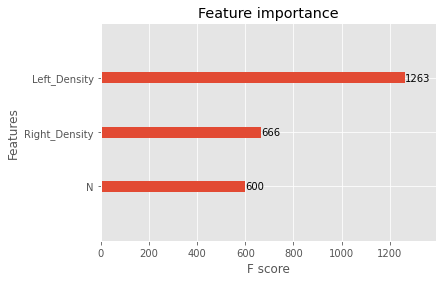

# XGBoost Algirithm
- Extreme Gradient Boosting
- 설명 : 여러개의 Decision Tree를 조합해서 사용하는 Ensemble 알고리즘
        Gradient Boost 알고리즘을 병렬 학습이 지원되도록 구현한 라이브러리
- 장점 : GBM 대비 빠른 수행시간, 과적합 규제, 조기 종료 기능 존재, Customizing 용이

## params
* 일반 파라미터
    + booster (default=gbtree)
        - 어떤 부스터 구조를 쓸지 결정
        - 의사결정기반모형(gbtree), 선형모형(gblinear), dart 존재
    + n_jobs
        - XGBoost를 실행하는 데 사용되는 병렬 스레드 수
    + verbosity (default=1)
        - 유효한 값은 0 (무음), 1 (경고), 2 (정보), 3 (디버그)
* 부스터 파라미터
    + learning_rate (default=0.3) : 학습률
    + n_estimators (default=100) : 생성할 weak learner의 수
    + max_depth (default=6) : 트리의 maximum depth를 설정
    + min_child_weight (default=1) : 관측치에 대한 가중치 합의 최소
    + gamma (default=0) : 리프노드의 추가분할 결정의 최소손실 감소값
    + subsample (default=1) : week learner가 사용하는 데이터 샘플링 비율
    + colsample_bytree (default=1) : tree별 사용하는 feature의 비율
    + lambda (default=1) : 가중치에 대해 L2 Regularization 적용 값
    + alpha (default=0) : 가중치에 대해 L1 Regularization 적용 값
* 학습 과정 파라미터
    + objective (default: reg=sqarederror)
        - reg:squarederror : 제곱 손실 회귀
        - reg:squaredlogerror : 제곱 로그 손실 회귀
        - binary:logistic (binary:logistic classification) : 이항 분류 문제 로지스틸 회귀 모형
        - binary:logitlaw : 이진 분류 로지스틱 회귀, 로지스틱 변활 전 출력 점수
        - binary:hinge : 이진 분류 힌지 손실, 확률 생성이 아닌 0 또는 1의 예측 생성
        - multi:softmax : 다항 분류 문제의 경우 softmax를 사용해서 분류하는데 반환되는 값이 예측확률이
                        아니라 클래스임 num_class도 지정
        - multi:softprob : 각 클래스 범주에 속하는 예측확률을 반환
        - count:poisson : 개수 데이터에 대한 포아송 분포 출력 평균
    + eval_metric (reg_default=rmse, tree_default=logloss)
        - rmse : 제곱 평균 제곱근 오차
        - rmsle : 제곱 평균 제곱근 로그 오류
        - mae : 절대 오차
        - mape : 평균 절대 백분율 오차
        - mphe : Pseudo Huber 오류
        - logloss : 음의 로그 손실함수
        - error : 이진 분류 오류
        - error@t : 't'를 통한 이진 분류 오류
        - merror : 멀티클래스 분류 오류
        - mlogloss : 다항 클래스 로그 손실
        - auc (reciever operating characteristic curve) : 이진 분류기의 성능 평가
    + seed (default=0) : 재현 가능하도록 난수를 고정
    

- pip install
```bash
pip3 install xgboost
```
## model fitting
- Regressor
```python
from xgboost import XGBRegressor
model = XGBRegressor([params])
model.fit(X_train,Y_train)
```
- Classifier
```python
from xgboost import XGBClassifier
model = XGBClassifier([params])
model.fit(X_train, Y_train)
```

## xgboost model 검사
- model predict
```python
y_pred = model.predict(X_test)
```
- sklearn 라이브러리를 활용하여 model check
```python
metrics(Y_test,y_pred)
```
- xgb plot_importance 라이브러리를 사용해 변수 중요도 파악 
```python
from xgboost import plot_importance as xgb_plot_importance
fig1, ax1 = plt.subplot(figsize=(10,8))
xgb_plot_importance(model,ax=ax1)            # ax를 통해 pltd 위에 그릴수 있다.
```


- xgb plot_tree 라이브러리를 활용한 의사결정 트리 시각화
```python
from xgboost import plot_tree as xgb_plot_tree
fig2,ax2 = plt.gcf()
fig.set_size_inches(150,100)

# num_trees : 그림을 여러개 그릴시 그림 번호
# rankdir : 트리의 방향, 디폴트는 위아래 방향 ("LR" : 왼쪽에서 오른쪽 방향) 
xgb.plot_tree(model, num_tree=0, rankdir='LR',ax=ax2)
```

